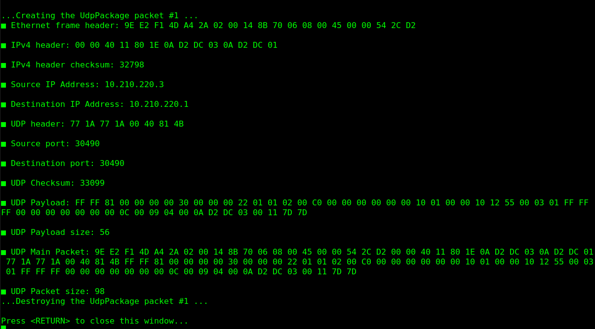
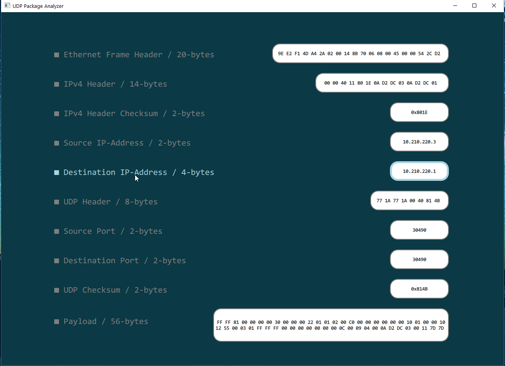

# UDP Package Analyzer

This project is a high-performance UDP packet analyzer designed to parse raw binary data from Ethernet frames. It provides a dual-view approach: Detailed outputs on the console and on a simplistic user interface.

## Features
* **Real-time Parsing:** Provides real-time processing structure of Ethernet, IPv4, and UDP headers.
* **Dual Monitoring:** Supports both terminal logging and a clean GUI dashboard.
* **Event-Driven:** Uses Qt's Signal-Slot mechanism to update the UI instantly when packet data changes.

## Project Structure
```text
├── LICENSE
├── README.md
├── UDP_Package_Analyzer.pro
├── images/
│   ├── Sample_Package_Analysis_Terminal_View.png
│   └── Sample_Package_Analysis_User_Interface_View.png
├── main.cpp
├── qml/
│   ├── ComponentDetailGeneric.qml
│   ├── ComponentLabel.qml
│   ├── DataContainer.qml
│   └── main.qml
├── qml.qrc
└── src/
    ├── UdpPackageAnalyzer.cpp
    └── UdpPackageAnalyzer.h
```

## Visual Analysis

### Analysis view on terminal
Technical breakdown and raw data parsing are logged directly to the console for low-level debugging and verification.



### Analysis view on UI
The simplistic UI provides an intuitive dashboard, where packet fields are updated dynamically.



## Architecture Overview
The project leverages a clean separation between the data model and the user interface.

## Requirements
* C++20 compatible compiler
* Qt Framework (v5.12 or newer recommended)